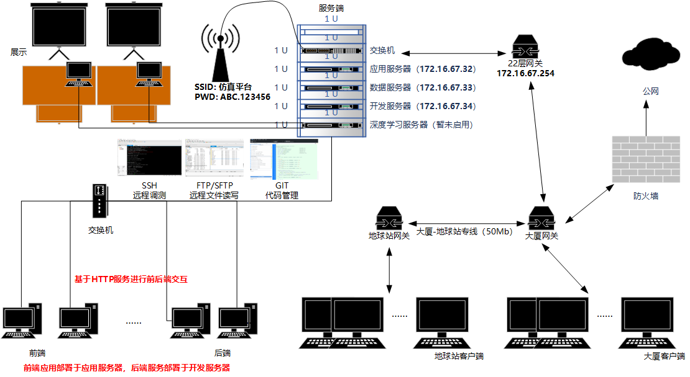

# 服务端

## 服务器信息
### 应用服务器
  + 系统：Windows Server 2019
  + 主机: 172.16.67.32
  + 用户名: Administrator
  + 密码: 123456
  + 用途：用于仿真平台主系统、频轨系统及各个Demo**系统的部署和运行**
  + 访问方式：
    1. 通过安装VNC Viewer可实现多用户同时登录操作，推荐指数：★★★★★
    2. 通过Windows自带的远程桌面实现登录操作，推荐指数：★★★

### 数据服务器
  + 系统：Windows Server 2019
  + 主机: 172.16.67.33
  + 用户名: Administrator
  + 密码:
  + 用途：用于仿真平台主系统、频轨系统及各个Demo系统的**数据存储、数据服务运行程序部署以及地图服务管理**
  + 访问方式：
    1. 通过安装VNC Viewer可实现多用户同时登录操作，推荐指数：★★★★★
    2. 通过Windows自带的远程桌面实现登录操作，推荐指数：★★★

### 开发服务器
### 操作系统及用户信息
  + 系统：Ubuntu 16.04
  + 主机: 172.16.67.34
  + 用户名: irdc
  + 密码: 123
  + 用途：用于后台服务接口调测和个人代码同步备份
  + 访问方式：
    + IDE（Pycharm专业版/IDEA专业版）内嵌的SSH会话，推荐指数：★★★★★
    + XSHELL / XFTP全家桶，推荐指数：★★★★
  + 代码部署路径：/home/irdc/source_code/"个人姓名全拼"
  + 调测端口说明：
    + 后台上线服务端口：5000
    + 个人调测端口：王运韬（5001）、苏浩然（5002）、李思洁（5003）、高源伯（5004）、张悦（5005）、杜绍杰（5006）
    + 个人完成调测后，再通过接口测试和代码评审，即可合并到5000端口进行发布
    
### 数据库信息
#### 卫星及行业应用数据（PostgreSQL数据库+PostGIS空间扩展）
  + 主机：172.16.67.33，端口：5432
  + 用户：postgres
  + 密码：vgis543^&*
  + 数据库：show_room
  + 架构：analysis(星地仿真分析)、public(数字化展厅)

#### 数管软件推荐
+ [DBeaver(开源，免费)](https://dbeaver.io/)
+ [Datagrip(JETBRAINS，学生账号/破解)](https://www.jetbrains.com.cn/datagrip/download/#section=windows)

## 基于[Gtiblit](http://gitblit.github.io/gitblit/)进行源码管理
+ 主机：172.16.67.32，端口：12345
+ 用户：个人姓名全称，如suhaoran/lisijie
+ 密码：默认密码为123456，登录后自行修改

### 登录方式
首次登录请通过浏览器登录方式完成**版本库地址查询**和**个人密码修改**。
+ 登录方式1：[Github Desktop](https://desktop.github.com/)，推荐指数：★★★★★
+ 登录方式2：IDE中内嵌的GIT插件，推荐指数：★★★★
+ 登录方式3：[Git Shell](https://git-scm.com/)，推荐指数：★★★

### 其他
- [GIT分支管理要求]()
- [如何在IDE中配置GIT]()
- [如何在Github Desktop中配置GIT]()

### 基于IIS FTP的文件管理
