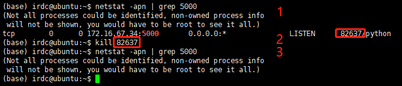

# 常用软件问题解决方案清单

## Python
### HTTP service
#### 基于Flask构建Web服务，端口正常启动后API调用报错
#### 解决方案（Win）
1. 查看端口监听和对应的PID
   ```
   netstat –ano | findstr 5000（结合个人设定的端口调整）
   ```
2. 关闭进程
   ```
   taskkill /pid 进程号（注意替换） /f
   ```
   
#### 解决方案（Linux-Ubuntu）
1. 查看端口监听和对应的PID
   ```
   netstat -apn | grep 5000（结合个人设定的端口调整）
   ```
2. 关闭进程
   ```
   Kill 进程号（注意替换）
   ```
   

### Anaconda
#### Anaconda长时间运行后无法关闭
#### 解决方案（WIN）
1. 找到未关闭的进程
   ```
   tasklist | findstr “pythonw”
   ```
2. 关闭进程
   ```
   taskkill /pid 进程号（注意替换） /f
   ```