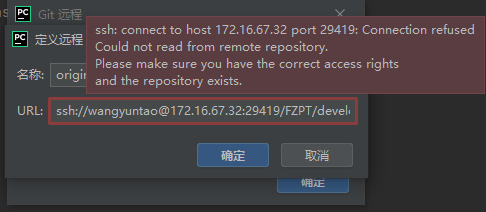

# 常用软件问题解决方案清单

## Git
### 1. gitblit
#### pycharm接入远程服务器上的git服务进行代码管理失败
#### 解决方案
1. 点击顶部菜单栏中的<u>VCS</u>，依次选择<b>启用版本控制集成</b> → <b>git</b>
2. 点击顶部菜单栏中的<u>Git</u>，选择管理远程
3. 拷贝版本库地址，完成git服务添加

4. 如在添加服务过程中存在下图显示问题

5. 依次点击顶部菜单栏中的<b>文件</b> → <b>设置</b> → <b>文件</b> → <b>版本控制</b> → <b>git</b>，将<u>版本库地址</u>拷贝至<b>Git可执行文件路径栏</b>中，点击测试，根据IDE提示完成相应版本git下载与安装
6. 重新执行步骤2和3即可

#### gitblit中文显示乱码
#### 解决方案
进入<b><u>.\gitblit-1.8.0\gitblit-1.8.0\data</u></b>目录下修改<b>defaults.properties</b>文件（此处请结合个人配置）
完成以下修改：

   ```
   web.blobEncodings = UTF-8 ISO-8859-1
                    ↓
   #web.blobEncodings = UTF-8 ISO-8859-1
   web.blobEncodings = GB2312
   ```

## Python
### HTTP service
#### Flask，端口正常启动后API调用报错
#### 解决方案
1. 查看端口监听和对应的PID
   ```
   netstat –ano | findstr  5000（结合个人设定的端口调整）
   ```
2. 关闭进程
   ```
   taskkill /pid 进程号（注意替换） /f
   ```

### Anaconda
#### Anaconda长时间运行后无法关闭
#### 解决方案
1. 找到未关闭的进程
   ```
   tasklist | findstr “pythonw”
   ```
2. 关闭进程
   ```
   taskkill /pid 进程号（注意替换） /f
   ```
   
@import "https://haogeshuohuanihaohaoting.github.io/static/mdCreateMenu.js"